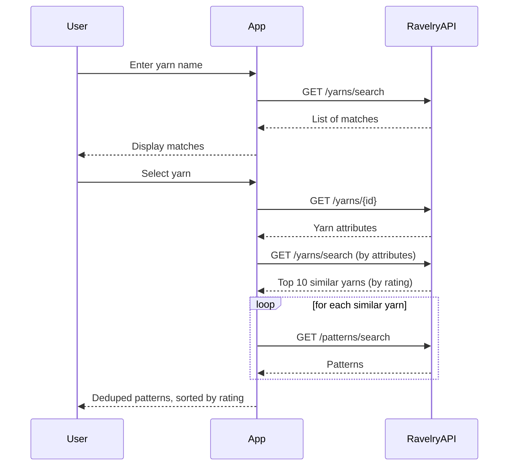

# Product Spec

## Overview

The knitting app helps someone go from "I have this yarn" to "here are patterns that will work with it." You type a yarn name, confirm which yarn you meant (Ravelry often has several yarns with the same name), and the app finds yarns with similar attributes, then surfaces patterns written for those similar yarns.

Because the interesting problem is the backend data flow, the UI is intentionally minimal — three screens, no extra chrome. Its job is to make the flow testable, not to be a polished product yet.

## User flow

1. User types a yarn name into a search field.
2. App shows a list of matching yarns for disambiguation (same yarn name can exist across multiple companies).
3. User selects the correct yarn from the list.
4. User optionally types a search term (e.g. "hat"). Field starts blank — no default value.
5. App shows a list of matching patterns.
6. User clicks a pattern to view/get it (external link out via Ravelry — the app builds the link client-side from the pattern's `permalink`, no backend resolution involved).

This is a single continuous funnel: **Yarn Search → Yarn Confirm → Pattern Results**.

Under the hood, step 5 involves more than a single lookup — the app fetches the selected yarn's full attributes, searches for similar yarns, and searches patterns across all of them:

## Screens (frontend)

- `YarnSearchScreen` — search box, list of name matches.
- `YarnConfirmScreen` — confirm the specific yarn (photo, company, weight).
- `PatternResultsScreen` — final pattern list, sorted by rating, with designer/favorites info.

## API (backend)

- `GET /api/yarns/search?query=` → list of `YarnSearchResult`
- `GET /api/yarns/{yarn_id}` → `YarnDetail`
- `GET /api/yarns/{yarn_id}/patterns?pattern_query=` → `YarnPatternMatches` (source yarn + similar yarns + deduped/sorted patterns)

All models mirror Ravelry's API shape (see `app/models.py`), with `extra="allow"` so unmodeled fields don't break parsing.

## Matching logic (current)

Implemented as `ExactAttributeMatcher` (`app/matching.py`), sitting behind the `YarnMatcher` abstract interface so the algorithm can change without touching routes or the Ravelry client.

Current match is an **exact** match on:
- `weight` (yarn weight name, e.g. "Lace")
- `fiber-content` (all fiber names, lowercased, joined with `+`, e.g. "silk+cotton" for a 2-fiber blend)
- `fiberc` (fiber count, must match exactly)
- needle size (min needle, in mm), when available

Percentage composition is not queryable via Ravelry's search API — percentage data only exists on full yarn details, not search results. For now, all yarns matching the above are included; percentage-based tolerance (e.g., ±10% per fiber) is a future enhancement to be checked client-side after fetching full yarn details.

Known limitations:
- No fuzzy matching — a yarn with an adjacent-but-different fiber or weight won't be found.
- Similar yarns are capped at the top 10 by rating before pattern search runs, to bound the number of pattern-search calls.

### Ravelry query parameters (`GET /yarns/search.json`)

| Parameter | Value | Description |
|---|---|---|
| `weight` | yarn weight name (e.g. `Lace`) | weight category from the source yarn's `yarn_weight.name` |
| `fiber-content` | all fiber names, lowercased, `+`-joined (e.g. `silk+cotton`) | all fibers from the source yarn's `yarn_fibers`, joined with `+` (AND semantics — all must be present); Ravelry constrains results to yarns with exactly this fiber set when combined with `fiberc` |
| `fiberc` | fiber count (e.g. `2`) | number of distinct fibers in the source yarn; combined with `fiber-content`, ensures results have exactly the same fiber set |
| `ya` | ply + `-ply` (e.g. `2-ply`) | present in the original prototype but currently commented out in `ExactAttributeMatcher` |
| `needles` | min needle size in mm (e.g. `3.0mm`) | only included when the source yarn has a min needle size |

A working Postman collection with example requests against these endpoints (yarn search, yarn-by-id, attribute search, pattern search) lives in the Obsidian vault (`Ravelry.postman_collection.json`) rather than in this repo — it's a manual API-exploration tool, not living documentation, so it isn't duplicated here.

## Domain reference: yarn attributes

Used for matching and worth keeping in one place as Ravelry's taxonomy is large and easy to mis-type.

**Fiber types** (grouped): Angora, Alpaca, Cellulose (Bast Bamboo, Flax, Hemp, Ramie), Cotton, Goat (Cashmere, Mohair, other), Manufactured (Acrylic, Angelina, Carbonized Bamboo, Corn/Ingeo, Firestar, Metallic, Microfiber, Milk, Nylon/Polyamide, Polyester, Rayon, Rayon from Bamboo, Rayon from Banana, Soy Silk, Stellina, Tencel/Lyocell), Other Animal (Yak), Silk (Bombyx/Cultivated, Eri/Peace Silk, Tussah, Muga), Wool (all standard breeds — Merino, BFL, Corriedale, Shetland, Cormo, etc. — see Ravelry's full breed list).

**Weight categories** (`yarn_weight.name`): Thread, Cobweb, Lace, Light Fingering, Fingering, Sport, DK, Worsted, Aran, Bulky, Super Bulky, Jumbo.

**Other attributes used in matching**: knit gauge (numeric), min/max needle size.

## Non-goals (for now)

- Not handling multi-fiber-composition matching.
- Not filtering by gauge or needle size in the UI yet (see `roadmap.md`).
- No auth/user accounts — single-user, local dev tool at this stage.
