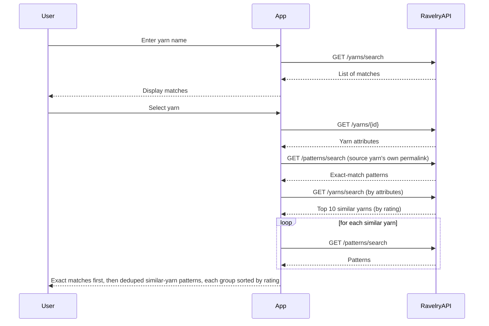

# Product Spec

## Overview

The knitting app helps someone go from "I have this yarn" to "here are patterns that will work with it." You type a yarn name, confirm which yarn you meant (Ravelry often has several yarns with the same name), and the app shows patterns written for that exact yarn (when they exist) plus patterns written for similar yarns — so you see everything you could plausibly make with what you have, not just the (often small) set of patterns designed around that specific yarn.

Because the interesting problem is the backend data flow, the UI is intentionally minimal — three screens, no extra chrome. Its job is to make the flow testable, not to be a polished product yet.

## Why this app exists

Most yarn/pattern tools (including Ravelry's own pattern pages) assume you go **pattern-first**: pick a pattern you love, then buy the yarn it calls for. That's a real and common way to knit, but it's not the only one, and it's not what this app is for.

This app is for going **yarn-first** — you already have the yarn (or are standing in front of it) and want to know what you could make with it. That happens for a few different reasons:

- **Spontaneous/in-store**: you walk into a yarn shop that day with no plan, see what's actually on the shelf, and want to decide what to make based on what's there — not go home, find a pattern, and come back.
- **Availability-constrained**: you live somewhere that doesn't stock the yarns popular pattern designers write for (a common experience outside the US/UK yarn market). The yarn you can actually get isn't the yarn most patterns assume, so you need to go from "here's what I have access to" to "here's what I can make with it," not the other way around.

Because of this, pattern results deliberately include **both**: patterns written for the exact yarn (the strongest possible match, when one exists — most yarns have few or none) and patterns written for similar yarns (which expand the pool considerably). Exact matches are always at least as good as a substitute, so they're ranked first.

## User flow

1. User types a yarn name into a search field.
2. App shows a list of matching yarns for disambiguation (same yarn name can exist across multiple companies).
3. User selects the correct yarn from the list.
4. User optionally types a search term (e.g. "hat"). Field starts blank — no default value.
5. App shows a list of matching patterns.
6. User clicks a pattern to view/get it (external link out via Ravelry — the app builds the link client-side from the pattern's `permalink`, no backend resolution involved).
7. **Pagination (Steps 1 & 2 done):** Results are paginated to show 20 items per page. When user reaches the last page within a batch of similar yarns (top 10 by rating), the Next button fetches patterns for the next batch of similar yarns, if available. Similar yarns are fetched in groups of 10, with automatic lazy-loading as the user paginate through patterns.

This is a single continuous funnel: **Yarn Search → Yarn Confirm → Pattern Results**.

Under the hood, step 5 involves more than a single lookup — the app fetches the selected yarn's full attributes, searches for similar yarns, and searches patterns across all of them:


```mermaid
sequenceDiagram
    participant User
    participant App
    participant RavelryAPI

    User->>App: Enter yarn name
    App->>RavelryAPI: GET /yarns/search
    RavelryAPI-->>App: List of matches
    App-->>User: Display matches
    User->>App: Select yarn
    App->>RavelryAPI: GET /yarns/{id}
    RavelryAPI-->>App: Yarn attributes
    App->>RavelryAPI: GET /patterns/search (source yarn's own permalink)
    RavelryAPI-->>App: Exact-match patterns
    App->>RavelryAPI: GET /yarns/search (by attributes)
    RavelryAPI-->>App: Top 10 similar yarns (by rating)
    loop for each similar yarn
        App->>RavelryAPI: GET /patterns/search
        RavelryAPI-->>App: Patterns
    end
    App-->>User: Exact matches first, then deduped similar-yarn patterns, each group sorted by rating
```

## Screens (frontend)

- `YarnSearchScreen` — search box, list of name matches.
- `YarnConfirmScreen` — confirm the specific yarn (photo, company, weight).
- `PatternResultsScreen` — final pattern list: patterns for the exact yarn first, then patterns for similar yarns, each group sorted by rating, with designer/favorites info. See "Pattern match types" below for how these are told apart in the UI (still being worked out).

## API (backend)

- `GET /api/yarns/search?query=` → list of `YarnSearchResult`
- `GET /api/yarns/{yarn_id}` → `YarnDetail`
- `GET /api/yarns/{yarn_id}/patterns?pattern_query=` → `YarnPatternMatches` (source yarn + similar yarns + deduped/sorted patterns)

All models mirror Ravelry's API shape (see `app/models.py`), with `extra="allow"` so unmodeled fields don't break parsing.

## Matching logic (current)

Implemented as `ExactAttributeMatcher` (`app/matching.py`), sitting behind the `YarnMatcher` abstract interface so the algorithm can change without touching routes or the Ravelry client.

Current match is an **exact** match on:
- `weight` (yarn weight name, e.g. "Lace")
- `fiber-content` (all fiber names, lowercased, joined with `+`, e.g. "silk+cotton" for a 2-fiber blend)
- `fiberc` (fiber count, must match exactly)
- needle size (min needle, in mm), when available

Percentage composition is not queryable via Ravelry's search API — percentage data only exists on full yarn details, not search results. For now, all yarns matching the above are included; percentage-based tolerance (e.g., ±10% per fiber) is a future enhancement to be checked client-side after fetching full yarn details.

Known limitations:
- No fuzzy matching — a yarn with an adjacent-but-different fiber or weight won't be found.
- Similar yarns are capped at the top 10 by rating before pattern search runs, to bound the number of pattern-search calls.

### Ravelry query parameters (`GET /yarns/search.json`)

| Parameter | Value | Description |
|---|---|---|
| `weight` | yarn weight name (e.g. `Lace`) | weight category from the source yarn's `yarn_weight.name` |
| `fiber-content` | all fiber names, lowercased, `+`-joined (e.g. `silk+cotton`) | all fibers from the source yarn's `yarn_fibers`, joined with `+` (AND semantics — all must be present); Ravelry constrains results to yarns with exactly this fiber set when combined with `fiberc` |
| `fiberc` | fiber count (e.g. `2`) | number of distinct fibers in the source yarn; combined with `fiber-content`, ensures results have exactly the same fiber set |
| `ya` | ply + `-ply` (e.g. `2-ply`) | present in the original prototype but currently commented out in `ExactAttributeMatcher` |
| `needles` | min needle size in mm (e.g. `3.0mm`) | only included when the source yarn has a min needle size |
| `sort` | sort order (e.g. `popularity`) | optional; supported by both `/yarns/search.json` and `/patterns/search.json` for result ordering |

A working Postman collection with example requests against these endpoints (yarn search, yarn-by-id, attribute search, pattern search) lives in the Obsidian vault (`Ravelry.postman_collection.json`) rather than in this repo — it's a manual API-exploration tool, not living documentation, so it isn't duplicated here.

## Domain reference: yarn attributes

Used for matching and worth keeping in one place as Ravelry's taxonomy is large and easy to mis-type.

**Fiber types** (grouped): Angora, Alpaca, Cellulose (Bast Bamboo, Flax, Hemp, Ramie), Cotton, Goat (Cashmere, Mohair, other), Manufactured (Acrylic, Angelina, Carbonized Bamboo, Corn/Ingeo, Firestar, Metallic, Microfiber, Milk, Nylon/Polyamide, Polyester, Rayon, Rayon from Bamboo, Rayon from Banana, Soy Silk, Stellina, Tencel/Lyocell), Other Animal (Yak), Silk (Bombyx/Cultivated, Eri/Peace Silk, Tussah, Muga), Wool (all standard breeds — Merino, BFL, Corriedale, Shetland, Cormo, etc. — see Ravelry's full breed list).

**Weight categories** (`yarn_weight.name`): Thread, Cobweb, Lace, Light Fingering, Fingering, Sport, DK, Worsted, Aran, Bulky, Super Bulky, Jumbo.

**Other attributes used in matching**: knit gauge (numeric), min/max needle size.

## Pattern match types

Pattern results come from two sources, and this is intentional (see "Why this app exists" above), not a bug to dedupe away: patterns written for the exact source yarn, and patterns written for yarns similar to it. A pattern found via the source yarn is always classified as "exact," even if it would have also turned up under a similar yarn's search — exact is the stronger, truer claim.

**In the UI** (`PatternResultsScreen`):
- The two groups are rendered as separate sections with section titles.
- Exact-match group: "Made for this yarn" (appears first).
- Similar-match group: "Patterns for similar yarns" (appears second).
- If the exact group is empty, the similar group's heading becomes: "No patterns are written for this exact yarn yet — here's what works with similar yarns."
- Each similar-match card shows "via {yarn.name}" below the pattern name to indicate which yarn it matched via.
- Each group is sorted by rating internally; groups are concatenated (not one blended sort across both).

**In the API** (`MatchedPattern` model):
```python
class MatchedPattern(BaseModel):
    pattern: Pattern
    match_type: str  # "exact" or "similar"
    matched_yarn: YarnSearchResult | None = None  # None for exact matches
```

## Non-goals (for now)

- Not filtering by gauge or needle size in the UI yet (see `roadmap.md`).
- No auth/user accounts — single-user, local dev tool at this stage.
